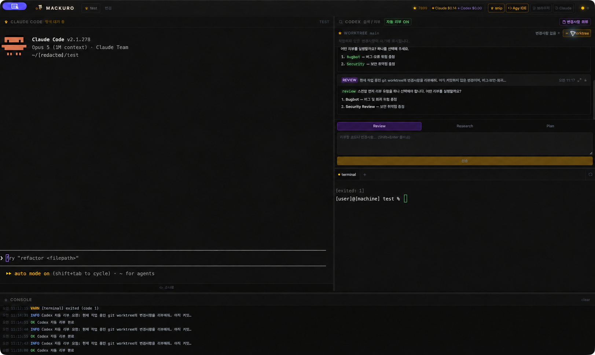

# MacKuro

macOS 전용 AI 개발 워크스페이스입니다. 검은 고양이와 해골 투구를 콘셉트로 하며, Claude가 코딩을 담당하고 Codex가 리뷰와 리서치를 담당합니다.

## 실제 기능 화면

최근 MacKuro 실행 화면입니다. Worktree 변경사항, Codex Review, 자동 리뷰 상태,
Agy IDE 연동 버튼, 터미널과 콘솔을 한 화면에서 확인할 수 있습니다.



## 구성

- Claude Code: macOS zsh 기반 인터랙티브 터미널
- Codex: `codex exec` 기반 Review / Research 패널
- Dev Server: 여러 개의 독립적인 zsh 터미널 탭
- 공유 브라우저: Chrome 또는 Edge CDP 연결
- Agy IDE 확장: 코드와 진단 정보를 MacKuro로 전송
- Playwright MCP: Claude용 MCP 설정 자동 갱신

## 요구사항

- macOS
- Node.js 18 이상
- Claude Code CLI (`claude`)
- Codex CLI 또는 ChatGPT macOS 앱
- Git
- 선택: Google Chrome, Antigravity IDE

## 실행

```bash
npm install
npm run dev
```

Codex는 `/Applications/ChatGPT.app/Contents/Resources/codex`, `~/.local/bin/codex`, PATH의 `codex` 순서로 탐색합니다.

## 패키징

```bash
npm run package
```

DMG와 ZIP이 `kuro-dist/`에 생성됩니다.

## Agy IDE 확장

```bash
cd agy-extension
npm install
npm run build
npx @vscode/vsce package --no-dependencies
```

MacKuro 앱이 실행되면 확장이 `127.0.0.1:7890`으로 선택 코드와 진단 정보를 전송합니다. 요청은 `~/.kuro/token` 세션 토큰으로 인증됩니다.

## 주요 흐름

프로젝트를 열면 `package.json`의 `dev`, `start`, `serve`, `preview` 스크립트를 감지하고 Playwright MCP를 설정한 뒤 Claude와 첫 번째 Dev Server 터미널을 실행합니다. Codex 패널에서는 변경사항 리뷰, 기술 리서치, 터미널 선택 영역 전송을 사용할 수 있습니다.
